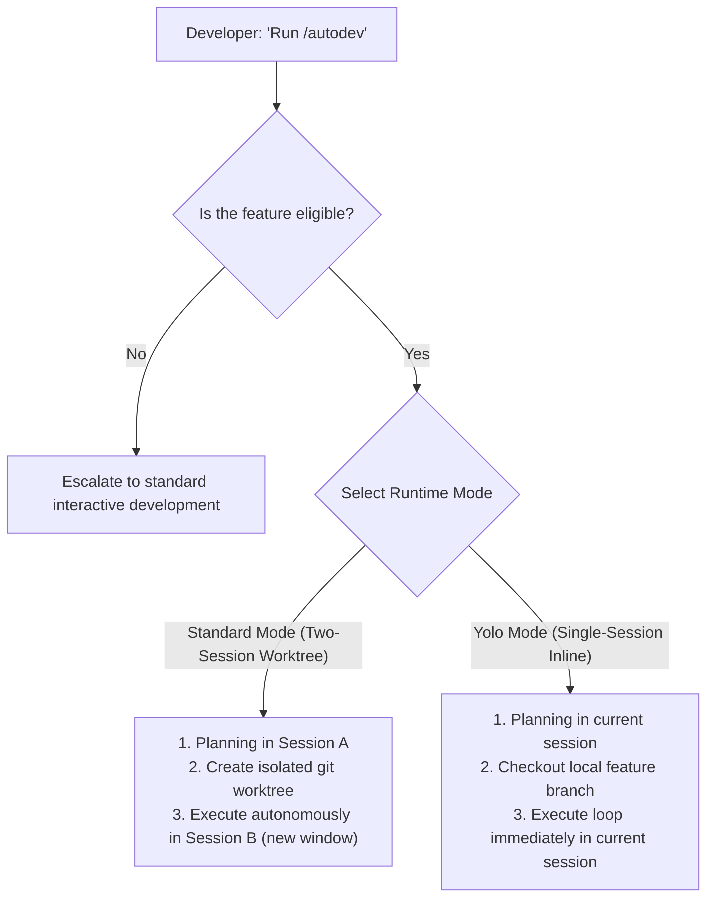

# 🤖 /autodev — Universal Autonomous Feature Development Protocol

> **[FIRST-RUN / STARTUP BLOCK — AGENT INSTRUCTIONS]**
> ### 🛑 AGENT SELF-CUSTOMIZATION PROTOCOL
> If you are the AI agent reading this block, it means this `/autodev` protocol has not been customized for this repository yet. You **MUST** stop and execute this self-customization sequence before performing any actual feature development.
> 
> Follow these steps immediately:
> 
> #### Step 1: Prompt the User
> Ask the user to clarify their stack, risk tolerance, and preferences. You may copy and paste the following template to prompt them:
> 
> > 🚀 **Autodev Initialization Initiated!**
> > Let's customize this protocol for your codebase. Please answer the following:
> > 
> > 1. **What is your Tech Stack?** (e.g., React + TypeScript + Vite + Node.js, Rust + Actix, Python + FastAPI, etc.)
> > 2. **What are your exact local verification commands?**
> >    * *Compilation/Typecheck*: (e.g., `npx tsc --noEmit` or `cargo check`)
> >    * *Linting/Static Analysis*: (e.g., `npm run lint` or `eslint .`)
> >    * *Production Build*: (e.g., `npm run build` or `vite build`)
> >    * *Test Suite*: (e.g., `npm run test` or `cargo test`)
> > 3. **What is your Risk Tolerance level?** 
> >    * `High`: YOLO mode is default; writing/updating existing files is relaxed; database writes are okay; less strict file protection rules.
> >    * `Medium` (Recommended): Balanced; isolation preferred for non-trivial edits; database writes scoped only to feature namespaces.
> >    * `Strict`: Worktrees mandatory; strict "New Files Only" limit; zero production DB changes; zero changes to shared configs/routing manifests.
> > 4. **What are your Protected Files?** (Files the AI must *never* edit autonomously, such as `.env`, `package-lock.json`, database configurations, auth middleware, etc.)
> > 5. **What is your environment config?** (e.g., Local dev server port, Staging URL)
> 
> #### Step 2: Adapt and Re-write This Protocol
> Once the user provides answers, edit the sections of this file to fit their parameters:
> * Update **The Eval Harness** block with their exact terminal commands.
> * Adjust the **Low-Risk Feature Criteria** and boundaries according to their selected `Risk Tolerance` level.
> * Update **Protected Files** lists in Phase 1, Phase 2, Phase 3, and Phase 4.
> * Fill out the **Environment Awareness Template** with their active URLs.
> 
> #### Step 3: Self-Destruct This Block
> After editing the sections, delete this entire `[FIRST-RUN / STARTUP BLOCK — AGENT INSTRUCTIONS]` block.
> 
> #### Step 4: Commit the Final Custom Protocol
> Perform a git commit (`git commit -am "chore(autodev): initialize custom autodev protocol for project"`) so the finalized, customized workflow is permanently saved for future sessions.
> ---

**Purpose**: Ship low-risk, self-contained features autonomously using an automated build-evaluate-iterate loop. The agent builds → evaluates → iterates → never stops until the feature is complete, verifying correctness at every step.

---

## 🧭 Runtime Mode Selection

At the start of the `/autodev` workflow, the developer chooses between two execution modes based on convenience and isolation preferences:



### ⚖️ Mode Decision Matrix

| Metric | 📁 Standard Mode (Two-Session Sandbox) | ⚡ Yolo Mode (Single-Session Inline) |
| :--- | :--- | :--- |
| **Sandbox Style** | Isolated git worktree (separate directory) | Local checkout on new branch (current directory) |
| **Context Scope** | 2 windows (Window A: Plan, Window B: Execute) | 1 window (Same session plans and immediately executes) |
| **Best Used For** | Large, complex features, multi-hour runs, overnight builds, or when you want to keep working on other things in your main window. | Tiny additions, small UI iterations, self-contained scripts, or when you want to monitor the loop progress in real-time. |
| **Human Supervision** | Zero supervision. Human closes window and awaits PR. | Minimal/Passive. Human watches loop outputs and can pause/interject if needed. |

---

## 🧠 Runtime Architectures

### 📁 Branch A: Standard Mode (Two-Session Sandbox)

This architecture spans **two separate AI conversation windows** (or session contexts) with isolated scopes to prevent instructions from colliding.

```
┌────────────────────────────────────────┐
│  SESSION A — Main Repo (Planning)      │
│                                        │
│  Planning Mode ON                      │
│  Artifacts: implementation_plan.md     │  ← Developer reviews & approves this
│                                        │
│  On approval:                          │
│   1. Writes custom spec file:          │
│      [feature-name]-autodev-spec.md    │  ← Custom-named cross-session handoff
│   2. Creates sandbox branch/worktree   │
│   3. Tells developer to open Session B │
└────────────────────────────────────────┘
                      │
                      │  Developer opens Session B in Sandbox
                      ▼
┌────────────────────────────────────────┐
│  SESSION B — Sandbox (Execution Loop)  │
│                                        │
│  Planning Mode OFF (execution only)    │
│  Reads spec from customized file:      │  ← [feature-name]-autodev-spec.md
│  Artifacts: task.md    (loop tracker)  │
│             walkthrough.md (final)     │
│                                        │
│  LOOP FOREVER until Done Definition   │
│  Pushes branch, creates PR             │
└────────────────────────────────────────┘
```

**The bridge between sessions** is a custom, feature-scoped specification file committed to the feature branch at `<feature-name>-autodev-spec.md` in the project root. Session A writes it; Session B reads it. Dynamic naming prevents conflicts during parallel builds.

---

### ⚡ Branch B: Yolo Mode (Single-Session Inline)

This architecture runs entirely in your **current active conversation and workspace window**. No worktrees are created, and no second window is required.

```
┌────────────────────────────────────────┐
│  ACTIVE SESSION — Current Workspace   │
│                                        │
│  1. Planning Phase (Planning Mode ON)  │  ← Developer approves implementation_plan.md
│  2. Branch Phase:                      │
│     Creates new branch locally         │  ← e.g. feature/yolo-<feature-name>
│  3. Execution Phase (Planning Mode OFF)│  ← Agent transitions inline to execute
│  4. Loop Iterations:                   │
│     Modifies code → Runs Eval Harness  │  ← Streamed directly to current chat
│  5. Push & Pull Request:               │
│     Pushes branch, opens PR, Handoff   │  ← Walkthrough written directly
└────────────────────────────────────────┘
```

---

## ⚠️ Eligibility Check — MUST READ BEFORE STARTING

Before accepting a `/autodev` task, the agent MUST verify that the request represents a low-risk, verifiable feature.

### ✅ Low-Risk Feature Criteria
A feature is eligible for `/autodev` if it satisfies ALL of the following criteria:

| Criterion | Check | Description |
|---|---|---|
| **Isolated Impact** | `[ ]` | The changes are isolated to new files, or are trivially additive to 1-2 existing integration points (like routers or navigation files). |
| **No Security-Critical Areas** | `[ ]` | No modifications to authorization, authentication, identity management, encryption, or payment/billing flows. |
| **No Core Config/Rules Changes** | `[ ]` | No changes to global security rules (e.g., Firestore rules, AWS IAM, database access lists) or core infrastructure code. |
| **Read-Only / Isolated Data Access** | `[ ]` | The feature uses read-only access to existing data models, or its writes are strictly isolated to the new feature's own scoped tables/documents. |
| **No Shared UI Component Changes** | `[ ]` | No modifications to shared UI components or utility functions used by other active features in the codebase. |
| **Verifiable Done Definition** | `[ ]` | The feature has a concrete, testable definition of done (e.g., "Page renders at route `/new-feature`, displaying data model `X` and handling click event `Y`"). |

**If ANY criterion is not met → Do NOT proceed with /autodev.** Escalate to the developer for standard, interactive development.

### 🔬 The Eval Oracle Rule
The ultimate boundary for AutoDev eligibility is whether the **local evaluation harness is a sufficient oracle for correctness**.

* **The harness CAN verify**:
  * Syntax correctness and compilation (`tsc --noEmit`, cargo check, go build, etc.)
  * Clean bundling and build pipelines without broken imports or assets
  * Static analysis, formatting, and linting rules
  * Offline unit and integration test suites
  * UI rendering/smoke testing in the local sandbox
* **The harness CANNOT verify**:
  * Cloud deployments, external API key validations, or environment-specific secret resolutions
  * Production database connectivity, performance under load, or live payment gateway behaviors
  * Runtime auth rules enforced only on remote cloud servers

---

## 📋 Pre-Flight: Describing the Feature

The developer describes the goal. The **planning agent drives the research and design**—do NOT pre-write the spec file yourself. 

To kick off the workflow, simply tell the agent:
> "I want to build [feature description]. Run /autodev [standard | yolo]."

The agent handles the rest in three phases: **Plan** → **Execute** → **Review**.

---

## 🚀 Phase 1: Plan & Approve (Planning Agent — Main Window)

This phase uses the agent's Planning Mode. The agent researches the codebase, produces an implementation plan, and waits for explicit developer approval.

### Step 1: Context Research
Follow a structured context-loading routine to ensure alignment with existing project patterns:
1. **Existing Patterns**: Read 1-2 files that implement similar features (e.g., search for existing routes, views, or hooks).
2. **Design Language**: Check standard UI layout systems, color variables, and styling paradigms (CSS/Tailwind configurations).
3. **Database Schema**: Verify the exact names, types, and constraints of data models (via schema files, types, or direct DB query tools if available).
4. **Manifests/Configuration**: Identify where the new feature must be registered (e.g., router configuration, main navigation bar).

### Step 2: Run Eligibility Check
Verify all items in the **Low-Risk Feature Criteria**. If any check fails, immediately pause, explain the risk to the developer, and switch to a standard interactive protocol.

### Step 3: Red Team the Plan
Critique the design before writing code:
* How could this change break the existing compilation or build pipeline?
* Does it introduce any new third-party dependencies? (If yes, flag this for explicit human approval).
* Could it break any existing route or shared component?
* Are there any potential edge cases or error states (e.g., loading states, network failures, empty database responses) that need custom handling?

### Step 4: Write `implementation_plan.md`
Create a native implementation plan document containing:
* **Goal**: A clear, single-paragraph statement of what will be delivered.
* **Entry Point**: The route, API endpoint, or UI button where the feature is accessed.
* **New Files**: The exact list of files to be created.
* **Data Access**: Any database tables, collections, schema fields, or external APIs to read/write.
* **Design Reference**: Pre-existing components, components library links, or design tokens to match.
* **Protected Files Contract**: An explicit list of files the agent promises **never** to edit.
* **Done Definition**: A checklist of verifiable functional requirements.
* **Open Questions**: Design details or technical decisions that require developer input.

Set `RequestFeedback: true` on this plan. **Do not proceed to execution until the developer explicitly approves this plan.**

---

### Step 5: Bootstrap Execution (First Action on Approval)

Once the developer approves the plan, branch based on the selected mode:

#### 📁 Standard Mode Branch (Two-Session Sandbox)
1. **Write `<feature-name>-autodev-spec.md`**: Create a custom, feature-scoped spec file in the project root. Convert the feature name into a lowercase, hyphen-separated slug (e.g., `user-profile-autodev-spec.md`). 
   > ⚠️ **CRITICAL RULE**: Do not name the file `autodev-spec.md`. It **MUST** be prefixed with the feature/mission slug to prevent filename collisions during parallel development or leftover spec file clutter.
2. **Setup Worktree**:
   ```bash
   git checkout main
   git pull
   # Create a separate worktree directory to isolate files completely
   git worktree add -b feature/autodev-<feature-name> ../worktrees/<feature-name> main
   ```
3. **Commit Custom Spec**: Commit `<feature-name>-autodev-spec.md` directly into the worktree branch.
4. **Hand Off**: Tell the developer:
   > "✅ Plan approved! Feature branch `feature/autodev-<feature-name>` is created and bootstrapped with the custom spec file `<feature-name>-autodev-spec.md`. 
   > 
   > Please open this branch/worktree in a **new agent window** and run `/autodev` to start the autonomous build loop."

#### ⚡ Yolo Mode Branch (Single-Session Inline)
1. **Create Branch Locally**:
   ```bash
   git checkout main
   git pull
   # Create branch directly in current directory
   git checkout -b feature/yolo-<feature-name>
   ```
2. **Transition Immediately**: The agent declares:
   > "⚡ Yolo Mode activated. I have checked out the branch `feature/yolo-<feature-name>` locally. 
   > I am transitioning directly into the Autonomous Build Loop in this window. You will see progress updates streamed live in this chat!"
3. **Proceed directly to Phase 2** within the current conversation window.

---

## 🔁 Phase 2: The Autonomous Build Loop (Execution)

Planning Mode is turned OFF. The agent is strictly focused on writing, testing, and refining.

### Agent Orientation (Run Once)
Verify the environment:
1. Ensure the workspace is on the correct branch (`feature/autodev-*` or `feature/yolo-*`).
2. If in Standard Mode, locate and read `<feature-name>-autodev-spec.md` (prefix matches the current branch name feature slug). This is your absolute source of truth.
3. **Create a `task.md` artifact** to track your progress and log iterations.

---

### The Eval Harness
Define the exact set of commands that must pass with `exit code 0` before any git commit is kept. 
*(Customize these commands for your stack!)*

```bash
# Gate 1: Type Checking / Compilation (Must pass with 0 errors)
# [Example: npx tsc --noEmit, cargo check, go build]

# Gate 2: Static Analysis / Linting (Must pass with 0 violations)
# [Example: npm run lint, pylint, flake8]

# Gate 3: Production Bundling / Build (Must bundle successfully)
# [Example: npm run build, go build]

# Gate 4: Test Suite (All local unit tests must pass)
# [Example: npm run test, cargo test, pytest]
```

---

### The Autonomous Loop Cycle

Follow this strict loop until all requirements are met:

```
ITERATION N:
  1. Inspect Git status and current code state: git status
  2. Plan the next small, incremental change (focused on 1 done requirement at a time).
     * Before writing UI: Check design tokens, stylesheets, and existing component layouts.
     * Before writing Data Code: Double-check schemas and type signatures.
  3. Write/Modify Code: Only create files listed in the "New Files" list of the spec/plan, 
     or modify the 1-2 allowed integration points.
  4. Run the Eval Harness:
     * Execute compilation, linting, tests, and builds.
     * If all gates pass (Exit Code 0) → Proceed to Step 5.
     * If any gate fails → Fix the code and re-run.
  5. Commit on Pass:
     * Run a git commit with a clear, atomic message (e.g., "feat(profile): implement loading state").
  6. Revert on Repeated Failure:
     * If a change cannot pass the eval harness after 2 attempts, discard the changes (`git checkout -- <file>`), 
       log the failed experiment in the Iteration Log, and try a different implementation approach.
     * If blocked after 3 different approaches, trigger your debugging protocol to locate root causes.
  7. Update `task.md` (Mark items as completed [x] or in-progress [/], and log the iteration).
  8. Evaluate Done Definition: If all items in the plan are checked → GOTO Phase 3.
  9. If not fully done → Loop again (GOTO ITERATION N+1).
```

#### 🚫 Strict Boundaries during Loop:
* **NEVER** modify a file designated as a **Protected File** in the specification.
* **NEVER** add new third-party libraries or modify dependency manifests (like `package.json`, `Cargo.toml`, `go.mod`) without explicit permission.
* **NEVER** push commits directly to main, staging, or production branches.
* **NEVER** stop the loop to ask the developer a question mid-process unless completely blocked by a platform-level failure. Use your iteration log to pivot around roadblocks.

---

### Progress Tracking — Native `task.md` Artifact

Create this artifact at the start of Phase 2 to give the developer a real-time window into your progress:

```markdown
# AutoDev Progress: <Feature Name> (Mode: Standard/Yolo)
Branch: `feature/autodev-<feature-name>`

## Done Definition & Checklist
- `[x]` Orientation complete — Plan read, environment verified
- `[x]` Baseline commit — Empty component structure created
- `[/]` Requirement 1 — [Description of current task]
- `[ ]` Requirement 2
- `[ ]` All Eval Harness gates passing
- `[ ]` PR created

## Iteration Log
| Iteration | Intended Change | Eval Harness Result | Action / Decision |
|---|---|---|---|
| 1 | Create base layout file | ✅ Pass | Committed structure |
| 2 | Connect data retrieval hook | ✅ Pass | Committed hook integration |
| 3 | Custom animation setup | ❌ Compilation Fail | Reverted change; will simplify |
| 4 | Add standard transition animation | ✅ Pass | Committed animation |

## Autonomous Decisions Made
- Reused `X` layout template to match current project spacing.
- Handled empty states by returning a graceful fallback component.
```

---

## 🏁 Phase 3: Completion & Handoff

When every checklist item in the Done Definition is marked complete, prepare for handoff:

### Step 1: Pre-Push Security and Integrity Check
Run a final sanity check on all staged diffs before pushing:
* **Protected Files Check**: Run `git diff main...HEAD -- [protected paths]` to guarantee that zero lines of protected files were modified.
* **Secrets/Debug Check**: Scan your diff for any hardcoded API keys, secrets, test tokens, or leftover debugging console logs.
* **Aesthetic & Responsive Check**: Verify that UI elements are aligned and have clear mobile/responsive breakpoints.

### Step 2: Push Branch and Open Pull Request
1. **Final Commit**: Package any final code polish (`git commit -m "style(autodev): clean up margins and styling"`).
2. **Push**: Push the feature branch to the remote repository.
3. **Pull Request**: Generate a new PR pointing to the main target branch (e.g., `main` or `develop`) using your CLI tools or platform APIs.
   * **Title**: `[AutoDev] <Feature Name> (Yolo/Standard)`
   * **Body**: Paste the contents of your `task.md` (Checklist, Iteration Log, and Autonomous Decisions Made) so the developer has a rich, transparent review trail.

---

### Step 2.5: Remote CI/CD Verification Loop (Optional Feedback Loop)
If your repository is configured with remote GitHub Actions or similar CI/CD pipelines, execute the following validation block:

1. **Monitor Remote CI Checks**: Query the status of the remote checks for your PR or branch using command tools or API calls (e.g., `gh pr checks` or via Git MCP commands).
2. **Handle Failure / CI Triage Loop**:
   * If all checks pass (`Success`) → Proceed directly to **Step 3**.
   * If any remote action fails (`Failure`):
     1. Retrieve the remote build/test failure logs.
     2. Identify the breaking code block.
     3. Re-enter the **Phase 2 Loop** to construct a targeted patch.
     4. Commit the fix: `git commit -m "fix(ci): patch remote check failure - [details]"`
     5. Push the patch to trigger the CI runner again and GOTO **Step 2.5** to re-monitor.
3. **Poller Guardrail**: Limit remote check polling to a reasonable interval (e.g., check every 60 seconds, max 10 iterations) to avoid lockups. If a check times out or fails after 3 manual repair loops, flag it in `task.md` and escalate to the developer.

---

### Step 3: Write Handoff `walkthrough.md` Artifact
Create a native `walkthrough.md` artifact in this window to serve as the final handoff:
* **Deliverables**: A bulleted list of new files and registered integration routes.
* **Key Design Decisions**: Explain any choices you made (e.g., component patterns, CSS variables used).
* **Verification Results**: Paste your final successful test outputs, build outputs, and local UI rendering summaries.
* **Testing Steps for Developer**: Quick instructions on how the developer can test the feature locally (e.g., "Checkout branch, run dev command, navigate to `/new-route`").

### Step 4: Final Signal
Print a concise completion message to the chat:
> "✅ **AutoDev Loop Completed!**
> * **Feature**: <Feature Name>
> * **Branch**: `feature/yolo-<feature-name>` or `feature/autodev-<feature-name>`
> * **PR**: [Link to Pull Request]
> * **Status**: All Eval Harness Gates and Remote CI Checks passed successfully in N iterations.
> 
> Please review the comprehensive `walkthrough.md` artifact created in this window for complete details and local testing instructions."

---

## 🧹 Phase 4: Developer Review & Merge (Planning Agent — Main Window)

When the developer returns, they complete the merge:

### Review Checklist
- [ ] **Read Walkthrough**: Review the `walkthrough.md` artifact for all autonomous choices made by the execution agent.
- [ ] **Pull and Test**: Pull the branch locally, spin up the local environment, and verify visual and functional completeness.
- [ ] **Diff Audit**: Verify that the diff is entirely clean and that no protected configuration, backend functions, or manifest files were altered.
- [ ] **Merge**: Merge the Pull Request.
- [ ] **Spec Cleanup**: Delete the `<feature-name>-autodev-spec.md` spec file from the main branch as a post-merge cleanup commit.
- [ ] **Branch/Worktree Cleanup**: Delete the local and remote feature branches, and remove the sandboxed workspace/worktree (if Standard Mode).

---

## 📊 Environment Awareness Template
Use this template to map out project environments for your AI agent's orientation:

| Environment | Host/Base URL | Purpose | Access Level |
|---|---|---|---|
| **Local (Sandbox)** | e.g., `http://localhost:3000` | Building, compiling, running lint, and test suites | Fully read-write |
| **Staging/QA** | e.g., `https://staging.example.com` | Automated CI/CD deployments for remote integration tests | Triggered via PR merge |
| **Production** | e.g., `https://example.com` | Live site for production traffic | Restricted; release branch merges only |
